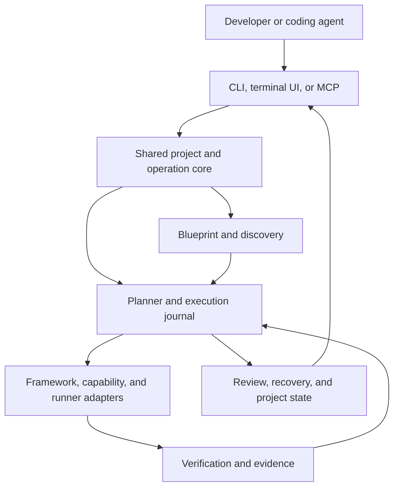

# Groot v2 — Product and Refactor Plan

**Status:** First planning pass; recommendations and future commands are proposals.

**Research date:** 30 September 2026.

**Repository baseline:** [bloxy-studios/groot](https://github.com/bloxy-studios/groot), main at [49eb95f7d835a1d7d101c923c7ffb993e8c0e0bf](https://github.com/bloxy-studios/groot/commit/49eb95f7d835a1d7d101c923c7ffb993e8c0e0bf), package version 1.10.0.

**Original input:** groot-plan.excalidraw, supplied by Abdul.

This document preserves the original vision, grounds the next direction in the implementation, and proposes a product that remains valuable as coding agents improve. The target audience, first recurring problem, and agent execution model remain open. The first choice-question round returned no selections, so its defaults are hypotheses rather than user decisions.

## 1. Product recommendation

**Groot helps developers and coding agents create, change, and maintain products through an explicit blueprint and verified operations.**

The enduring value is coherent project evolution: when someone adds authentication, introduces a mobile app, changes a backend, or delegates work to an agent, the architecture, environment contract, instructions, and validation stay in agreement.

Suggested product line: **Build it. Grow it. Prove it works.**

The product should earn repeat use after the first scaffold. A developer should return to Groot to understand a project, add a capability, recover a failed operation, inspect the effect of a change, or hand work to a different agent.

Design for increasingly capable agents through documented interfaces and stronger execution contracts. Model names and claims about AGI should have little influence on the core architecture.

### Working assumptions

| Decision | Provisional recommendation | What a different answer changes |
| --- | --- | --- |
| First users | Solo developers building with coding agents | Teams move shared policy, provenance, and review workflows earlier; beginners need more explanation and stronger defaults |
| First recurring problem | Setup and integration that can be verified | Context as the priority moves discovery and instruction synchronization earlier; coordination moves runner adapters and task state earlier |
| Agent supply | Existing installed coding tools | Native API sessions introduce provider billing, model routing, credential storage, and another agent loop |
| Interface | CLI first, with machine-readable contracts | A terminal UI is a view over the same operations; a desktop application becomes a separate surface |
| Runtime for Groot | Bun and TypeScript, consistent with the repository | Generated native projects retain their own platform toolchains |
| Reach | Start with a small certified combination matrix | More frameworks increase test and maintenance costs; add support by evidence and demand |

## 2. What the original diagram gets right

The diagram describes a useful progression: choose a single application or a monorepo, select web/mobile/desktop/API frameworks, then choose authentication and backend services. It also anticipates native-platform checks such as macOS and Xcode requirements.

Retain its broad platform vision and progressive choices. Improve the opening question. A user generally knows the product they want before they know its repository topology.

A better interview begins with outcomes:

1. What are you building, and who uses it?
2. Which surfaces are needed now: web, mobile, desktop, API, CLI, or an agent service?
3. What must work in the first version: accounts, shared data, payments, real-time updates, offline use, integrations?
4. Which constraints matter: existing code, budget, deployment target, platform, team conventions?
5. Which decisions are already fixed?
6. Recommend a supported blueprint, explain its tradeoffs, and show the planned operations.

Advanced users can choose frameworks directly. Agents can provide the same answers as structured input. A single app should be a valid topology; creating a monorepo should follow the product's needs.

## 3. Evidence from the current repository

The current implementation is a useful foundation for the refactor.

| Area | Observed implementation | Product implication |
| --- | --- | --- |
| Public CLI | Entry point registers init, add, and doctor | New commands should have explicit contracts and migration rules |
| Scaffolding | Sixteen framework choices across web, mobile, desktop, API, and backend | Preserve the adapter knowledge and validated platform behavior |
| Engine | Resolve, preflight, generate, stitch, and verify | Extract shared operations from these stages rather than recreating every adapter |
| Agent use | JSON output, dry runs, noninteractive execution, presets | Reliable scripting already exists and can grow into a stronger control interface |
| Manifest | Version 1 records scaffolds, generator series, paths, ports, and conventions | Add capabilities, relationships, configuration contracts, and operation provenance |
| Existing projects | add and doctor locate a groot.json created by Groot | Adoption of ordinary repositories is a meaningful new feature |
| Topology | Workspace conventions center on apps/* and packages/* | Single-app and native targets need a more general project model |
| Backend wiring | stitchBackendLinks adds a workspace dependency and environment placeholders | Add executable integration recipes and evidence of real behavior |
| Verification | verify checks package structure and install; doctor performs offline structure and adapter checks | Add build/runtime/product-flow verification with truthful completion states |
| Recovery | Generation cleanup exists; add rolls back a failed grow stage; subsequent stitch/verify writes remain | Broader project changes need a journal and ownership-aware recovery |
| Reproducibility | Generator selections include series such as create-next-app@16 | Capture exact resolved artifacts, integrity, adapter versions, and operation inputs |
| Expansion | CI/hooks, agent instructions, skills, MCP, and Drizzle/Better Auth/tRPC remain on the backlog | Reuse this research while checking every dated upstream assumption |
| Maintenance | An open drift issue flags generator pin changes | Adapter certification and drift recovery should remain core capabilities |
| Documentation | architecture.md retains a v0.2 status header and an older illustrative adapter shape | Align normative documents, current source, and published schemas during the refactor |

Source locations: [entry point](https://github.com/bloxy-studios/groot/blob/49eb95f7d835a1d7d101c923c7ffb993e8c0e0bf/packages/cli/src/index.ts), [engine types](https://github.com/bloxy-studios/groot/blob/49eb95f7d835a1d7d101c923c7ffb993e8c0e0bf/packages/cli/src/engine/types.ts), [manifest](https://github.com/bloxy-studios/groot/blob/49eb95f7d835a1d7d101c923c7ffb993e8c0e0bf/packages/cli/src/engine/manifest.ts), [stitch](https://github.com/bloxy-studios/groot/blob/49eb95f7d835a1d7d101c923c7ffb993e8c0e0bf/packages/cli/src/engine/stitch.ts), [verify](https://github.com/bloxy-studios/groot/blob/49eb95f7d835a1d7d101c923c7ffb993e8c0e0bf/packages/cli/src/engine/verify.ts), [doctor](https://github.com/bloxy-studios/groot/blob/49eb95f7d835a1d7d101c923c7ffb993e8c0e0bf/packages/cli/src/engine/doctor.ts), [add](https://github.com/bloxy-studios/groot/blob/49eb95f7d835a1d7d101c923c7ffb993e8c0e0bf/packages/cli/src/engine/add.ts), [roadmap](https://github.com/bloxy-studios/groot/blob/49eb95f7d835a1d7d101c923c7ffb993e8c0e0bf/docs/roadmap.md), [drift issue](https://github.com/bloxy-studios/groot/issues/81).

This was a static code and product review. No repository source was changed, no implementation tests were run, and current behavior was not validated by executing framework generators.

## 4. What has changed in the ecosystem

Agent-friendly scaffolding is already an established category. Better-T-Stack documents structured project/add-on input, schema discovery, dry-run planning, MCP, and coding-agent integration. Nx documents workspace graphs, generated instructions, skills, and agent-assisted CI workflows.

**Inference:** Adding MCP and instruction files will help Groot's usability, but differentiation needs to come from the work Groot completes: preserving a product's intent across changes and attaching executable evidence to those changes.

Supported coding-agent interfaces also reduce the need to invent another coding agent. Claude Code provides programmatic execution and structured output. Codex provides an SDK for jobs and an app-server interface for richer clients. ACP addresses communication with compatible coding agents; MCP exposes tools and data.

Use each interface for its actual purpose:

| Interface | Proposed Groot use |
| --- | --- |
| CLI and JSON contracts | Deterministic operations that humans, scripts, and agents can drive |
| Agent skills and instructions | Teach agents when and how to use those operations |
| MCP | Expose Groot's schemas, discovery, plans, operations, and evidence to tool clients |
| ACP | Optional runner/client adapter for agents that actually implement it |
| Vendor SDK or supported headless mode | Task execution, interruption, and session continuation according to that vendor's contract |

Compatibility is per adapter and version. A portable task brief and decision history can move between agents; private session state and provider-specific features require explicit support.

Current sources, checked 30 September 2026:

- [Better-T-Stack agent workflows](https://www.better-t-stack.dev/docs/cli/agent-workflows)
- [Nx coding assistant setup](https://nx.dev/docs/getting-started/ai-setup)
- [Nx agent skills](https://nx.dev/blog/nx-ai-agent-skills)
- [Claude Code programmatic execution](https://code.claude.com/docs/en/headless)
- [Codex SDK](https://developers.openai.com/codex/sdk)
- [Codex app server](https://developers.openai.com/codex/app-server)
- [ACP introduction](https://agentclientprotocol.com/get-started/introduction)
- [MCP introduction](https://modelcontextprotocol.io/docs/getting-started/intro)

The old backlog's prediction about MCP SDK release timing needs fresh verification at implementation time. Select a tested supported release then. Codex documentation currently distinguishes its job SDK from the richer app-server interface and marks WebSocket transport experimental; those differences belong in adapter certification.

## 5. The product model

Groot needs five first-class concepts.

**Project:** A discovered or created repository, with its topology, applications, packages, services, and supported toolchains.

**Capability:** A user-facing or operational result such as authentication, billing, a mobile client, search, a background worker, or an AI assistant.

**Blueprint:** Desired structure, selected capabilities, supported recipes, architecture decisions, and validation contracts.

**Operation:** A concrete change with preconditions, planned file transforms, dependency changes, commands, external actions, and recovery rules.

**Evidence:** Results that show what was checked, against which revision and environment, with clear failures and skipped checks.

Keep these concerns distinct:

| Concern | Example |
| --- | --- |
| Developer tooling | Claude Code helps implement a billing change |
| Product AI | The deployed application includes an AI assistant |
| Framework/application | Next.js, Expo, a Swift macOS app |
| Service/provider | Convex, PostgreSQL, an identity provider |
| Human decision | Which roles may access a paid feature |

A frontend framework and a payment provider have different lifecycles. Both can participate in the same product capability without being modeled as interchangeable scaffold slots.

### Desired state and observed state

The blueprint records intent. Discovery records what the repository currently contains. Reconciliation proposes changes between them.

Each inferred fact should include its source, confidence, and freshness. A decision confirmed by a human has a different authority from a guess based on a dependency name. Agents should be able to request current facts rather than depend on a long summary written weeks earlier.

Repository instructions, remote documents, plugin content, and code comments are inputs with provenance. Their discovery should not silently grant execution permissions.

## 6. The essential developer experiences

### A. Create a coherent product

Describe a product or select a blueprint. Groot recommends a supported combination, previews the changes, creates it, runs declared checks, and records unresolved setup.

The result should contain an illustrative vertical flow. For an authenticated application, that means sign-in, access to a protected route, and an authorized database operation. The completion report identifies the exact checks that passed.

### B. Bring an existing project into Groot

Discovery reads the existing structure and reports supported, inferred, and unknown parts. Adoption initially records facts and configuration. Layout changes are separate operations.

Respect custom app names, existing package managers, and native directories during discovery. The first writable adoption path can be limited to Bun/TypeScript projects while unsupported repositories remain inspectable.

### C. Add a working capability

A developer asks for accounts, billing, storage, or a new app surface. Groot resolves compatible recipes and dependencies, previews touched files, applies transforms, and verifies the declared behavior.

A capability recipe includes requirements, conflicts, versions, transforms, environment variables, application mounts, tests, optional service setup, and rollback limits.

### D. Keep agents informed

Generate concise instructions and task-scoped context from current facts. Preserve human-authored sections. Synchronization shows the proposed diff and refuses ambiguous ownership conflicts.

Include architecture decisions, commands, relevant paths, environment variable names, validation steps, and known limitations. Keep secret values out of generated instructions.

### E. Delegate a bounded change

Create a task with acceptance criteria and allowed capabilities. A supported agent adapter executes it in an isolated worktree and returns a change set plus evidence. The human reviews the result or applies a previously configured review policy.

Groot should distinguish scheduled, running, blocked, interrupted, failed, awaiting review, and completed states. Completion depends on acceptance criteria and validation rather than an agent's final sentence.

## 7. Feature landscape and sequencing

This catalogue preserves ambitious directions without committing all of them to the first release.

| Capability | User value | Suggested placement |
| --- | --- | --- |
| Outcome-based project interview | Recommend architecture from product needs | Foundation |
| Direct flags and structured blueprint input | Efficient expert and agent use | Foundation |
| Single app and monorepo topology | Match repository size to actual needs | Foundation, one certified path each |
| Existing-project discovery and adoption | Useful beyond new projects | Foundation, limited supported scope |
| Compatibility solver | Explain unsupported or conflicting choices | Foundation |
| Exact recipe and generator resolution | Reproducible operations | Foundation |
| Previewable file/dependency/command changes | Make changes understandable | Foundation |
| Operation journal and recovery | Recover from interruption or failure | Foundation |
| Dynamic port allocation | Run multiple applications predictably | Foundation |
| Environment contracts | Identify missing configuration and public/server boundaries | Foundation |
| Structural, build, runtime, and flow checks | Show evidence of working behavior | Foundation, checks by supported recipe |
| Synchronized agent instructions and skills | Reduce stale context | Foundation |
| JSON schemas, errors, and event streams | Make automation reliable | Foundation |
| Authentication and typed data recipes | Complete the first product flow | First capability release |
| Roles and organization tenancy | Support team-oriented products | Later capability release |
| Billing and entitlements | Build paid products with sandbox verification | Later capability release |
| Email, uploads, search, observability | Common product extensions | Later capability release |
| Background jobs and durable workflows | Handle long-running product behavior | Later capability release |
| AI app recipes and evaluation harnesses | Build applications that themselves contain agents | Later capability release |
| MCP facade over core operations | Use Groot through existing agent clients | After core contracts are stable |
| Terminal dashboard | Inspect tasks, diffs, evidence, and blocked decisions | After workflow needs are clear |
| Installed-agent runners | Execute bounded tasks with existing tools | Orchestration release |
| Task dependencies and worktrees | Coordinate related changes | Orchestration release |
| Review and integration queue | Combine changes with fresh validation | Orchestration release |
| Cross-agent handoffs | Continue work from portable briefs and evidence | Orchestration release |
| Usage and runtime limits | Bound time, concurrent jobs, and observable cost | Orchestration release |
| Provider/model routing | Choose capabilities according to user policy | Optional native API execution |
| CI repair workflows | Bring CI failures into the same task/evidence model | After local workflow is proven |
| Deployment adapters and previews | Carry verified code into an environment | After local lifecycle is proven |
| Preview databases and data isolation | Test changes against disposable resources | Cloud workflow release |
| Automated upgrades and codemods | Keep products current with clear diffs | After ownership and recovery work |
| Remote workers and sandboxes | Run work away from the developer's machine | Cloud workflow release |
| Reusable team blueprints | Share validated conventions | Team release |
| Signed/community recipe registry | Broaden support through maintainers | After adapter contract and trust model |
| GitHub issue-to-change workflow | Turn approved work into reviewable branches | Team/cloud workflow release |
| Native Swift, Flutter, Rust, Python, and CLI targets | Serve broader product types | Demand-led certified adapters |
| Editor and desktop clients | Richer human interaction | Later surfaces over the same core |
| Voice initiation and updates | Hands-free access to developer workflows | Later integration with a product such as Veyra |

A useful extra direction is “explain this change”: Groot reports why a file, dependency, permission, or service must change, with its recipe and decision provenance. Another is architecture drift: identify where the running repository differs from the blueprint and propose a targeted repair.

## 8. Proposed CLI contract

The following commands illustrate the intended experience. They are future proposals and do not exist in the current release.

```sh
# Discover an existing repository.
groot inspect . --json

# Record an adoption plan without changing the repository.
groot adopt . --dry-run --json

# Create an explicit plan for a product or capability.
groot plan init my-app --blueprint ./product.json --out ./init-plan.json
groot plan add auth --provider better-auth --out ./auth-plan.json

# Apply the concrete operation after checking its preconditions.
groot apply ./auth-plan.json

# Report environment, build, and product-flow evidence.
groot verify --scope auth --json
groot status --json

# Resume an interrupted operation or inspect recovery options.
groot resume <operation-id>
groot rollback <operation-id> --dry-run

# Inspect and synchronize task-relevant agent context.
groot context --task "Add account settings" --json
groot context sync --dry-run

# Later: execute bounded work through a supported agent.
groot task create "Add account settings" --agent codex
groot task run <task-id>
groot review <task-id>

# Later: expose the same contracts to MCP clients.
groot mcp
```

Retain current init, add, and doctor compatibility through a migration adapter. Explicit plan/apply commands suit complex changes; an ergonomic one-step command can create and execute the same plan according to user preferences. Routine local actions should follow the user's configured policy.

For automation:

- Publish input, plan, event, result, and error schemas with version numbers.
- Use stdout for machine output and stderr for progress.
- Define cancellation, exit codes, stable error identifiers, and prompt-free behavior.
- Return blocked decisions as structured results; provide readable choices to humans.
- Emit a plan ID, operation ID, schema version, precondition fingerprints, and evidence references.
- Make reapplication safe or explain the conflict.
- Redact secrets before logs leave the execution boundary.
- Keep detailed logs addressable instead of stuffing every log line into agent context.

A plan should show concrete file transforms, exact recipes, commands, external effects, required configuration, verification, and recovery limits. External generator output that cannot be fully predicted should be marked accordingly; staging can provide a concrete preview before promotion.

## 9. Refactor architecture

A complete refactor can preserve the existing behavior while introducing stronger internal boundaries.



Suggested responsibilities:

| Boundary | Responsibility |
| --- | --- |
| CLI | Argument parsing, prompts, display, exit behavior |
| Core | Project model, schema validation, compatibility, planning, orchestration |
| Discovery | Parse supported project files and record observations without executing arbitrary config |
| Transforms | Structured edits and ownership-aware merges |
| Adapters | Official generators, integration recipes, platform checks, supported agent/provider interfaces |
| Verification | Checks, controlled runtime probes, acceptance evidence |
| Journal | Operation events, checkpoints, artifact paths, recovery state |
| Context | Task-scoped fact retrieval and generated instructions |
| Protocol surfaces | JSON/API/MCP projections of the same core contracts |

Start with modules inside the current package. Split packages when dependencies, distribution, or maintainership justify the boundary. The CLI entry point should stay thin.

### State and ownership

Use a versioned project blueprint for portable desired state, a recipe lock for exact resolution, and local operation state for journals and evidence. Local task state can use Bun SQLite when query and recovery needs justify it. Avoid making task execution require a hosted account.

Each edit needs a precondition and ownership rule. Structured JSON/TOML edits, managed regions, and narrow source transforms are preferable to rewriting whole files. Complex code transforms should use a supported parser/codemod and return a conflict when a safe match is unavailable.

A human edit made after a plan was produced should invalidate that affected precondition. Replan the conflict without discarding unrelated completed work.

### Transactions and recovery

Stage generated files, record intended mutations, check preconditions, apply them, validate, then record the resulting state.

Filesystem changes can often be reversed from recorded before/after data. Provider actions need idempotency keys and compensating actions where supported. Report irreversible effects explicitly. A journal cannot make a remote database migration or resource deletion automatically reversible.

Worktrees isolate file edits. A sandbox separately controls filesystem access, processes, and network capabilities. Hosted execution should enforce these capabilities at the actual tool boundary.

## 10. Human and agent interaction

Humans should see useful decisions rather than a stream of tiny confirmations. Respect previously granted scope and configurable action classes.

| Interaction | Desired behavior |
| --- | --- |
| Unclear product requirement | Ask a short choice question with a recommendation and consequence |
| Compatible local change within granted scope | Execute according to the user's policy, then show evidence |
| Missing prerequisite | Surface a specific fix or supported handoff |
| Conflicting edits | Show the affected change and replan that portion |
| Paid provisioning or production-affecting action | Apply the policy for that action and show concrete effects |
| Agent interruption | Save state, terminate supported subprocesses correctly, and make resumption explicit |
| Failed acceptance check | Mark the task incomplete and attach evidence |
| Human changes direction | Update the task/blueprint and recompute affected work |

Agent runners should report a capability matrix: structured events, cancellation, resumability, permission callbacks, cost reporting, and supported authentication. Reuse a tool's documented login mechanism. Groot-owned provider connections should use supported OAuth or explicitly supplied credentials in an appropriate local store.

Cost reporting should distinguish observed charges, estimates, and unavailable data. Enforce supported token/spend limits and operation wall-time limits. Subscribed CLI sessions may provide different usage information from API-key sessions.

For multi-agent work, create bounded tasks only when there is independently useful work. Record dependencies, limit parallelism, isolate changes, and revalidate the combined result. A successful review comment is an input; executable acceptance checks supply additional evidence.

Keep shared decisions, repository facts, task evidence, and private agent sessions separate. Memory needs sources and invalidation rather than an accumulating transcript.

## 11. First complete release

The first complete slice should prove a concrete loop:

**Create or adopt a supported Bun/TypeScript project → add authentication and typed persistence → synchronize instructions → verify a protected flow → recover a simulated interruption safely.**

Suggested reference stack: one web framework, one API path where needed, a locally testable database, and one auth recipe. The exact combination should follow the product choices and compatibility research. Existing scaffold adapters remain available through compatibility paths while new lifecycle support is certified incrementally.

The first release is complete when:

- Creation works for the selected single-app and monorepo paths.
- Adoption preserves a representative existing project's layout and custom changes.
- Unsupported combinations fail during planning with useful alternatives.
- Planned edits identify touched files and dependency changes.
- Exact adapter/recipe versions are recorded.
- Applying the same completed plan causes no duplicate changes.
- Changed preconditions produce a useful conflict.
- An interruption can resume without corruption.
- Context synchronization preserves human sections.
- A signed-in user can access a protected operation; an unauthorized user fails the declared check.
- Build, runtime, and flow checks report pass, fail, skipped, or blocked truthfully.
- Missing service credentials appear as blocked setup with clear next steps.
- JSON mode completes without prompts and follows its published schema.

Track time to first verified product flow, capability-add success, recovery success, human edits preserved, agent setup/context failures, and return use after project creation. Establish a baseline before selecting numeric launch targets.

## 12. Release plan for the refactor

| Stage | Main work | Exit evidence |
| --- | --- | --- |
| 0. Baseline and decisions | Confirm audience/problem, capture v1 contracts, refresh drift research, choose reference stack | Agreed scope, source-backed adapter inventory, reproducible baseline checks |
| 1. Shared operation core | Schema v2, discovery, blueprint, compatibility, plan/apply, preconditions, journal | Existing commands pass contract checks through compatibility; failure/recovery cases pass |
| 2. Verified product capabilities | Auth/data vertical flow, structured transforms, environment contracts, context sync | The reference product flow works from creation and adoption |
| 3. Agent execution | One runner, task state, worktrees, reviews, cancellation; then a second runner | Bounded tasks complete, interruption works, combined changes pass fresh checks |
| 4. Broader lifecycle | Selected billing/AI/upgrade/deploy recipes and CI integration | Each capability earns certified support through end-to-end evidence |
| 5. Teams and ecosystem | Shared blueprints, richer policy, remote execution, recipe registry | Repeatable collaborative workflows and a sustainable certification process |

Order stages by the answers to the decision questions. Agent execution should move earlier only if task coordination becomes the chosen first problem.

A suggested implementation branch is refactor/groot-v2-core. This review has not created it. Use small reviewed changes within that branch, major-version migration semantics where needed, and a prerelease channel before replacing the stable package.

Preserve repository requirements: Bun, strict TypeScript/ESM, Biome, changesets for package behavior, pinned GitHub Actions, conventional commits, and the existing review requirements.

## 13. Engineering validation

Prioritize tests that prove the user and operation contract:

- Legacy flags, JSON output, exit codes, and manifest loading.
- Blueprint migrations and unsupported-version errors.
- File ownership, stale plans, and conflicting human edits.
- Interrupted operations, cancellation, idempotency, and recovery.
- Recipe dependency/conflict resolution.
- Exact child-process arguments and prompt-free failures.
- Environment boundary checks and secret redaction.
- Product-flow acceptance in a controlled test environment.
- Adapter integration tests against pinned upstream artifacts.
- Fresh validation of combined agent changes.

Keep structural doctor checks fast and offline. Provide explicit deeper verification profiles for build, runtime, and product flows. Running these profiles may start applications or contact configured services and should follow the operation policy.

A placeholder type file or a successful install supplies structural evidence. Mark configured-service and live-flow evidence separately so users know what is ready.

## 14. Decisions for the next planning rounds

The first round asked about first users, first recurring pain, and existing coding tools versus native API execution. Those answers remain unconfirmed.

Subsequent rounds should settle concrete tradeoffs:

| Round | Decision | Why it matters |
| --- | --- | --- |
| 2 | Typical first project: paid web product, cross-platform app, or agent service | Determines the first certified vertical flow |
| 2 | Work performed locally versus hosted workers | Changes operating cost, permissions, and recovery requirements |
| 2 | How much unattended work the user wants | Determines task policy and review checkpoints |
| 3 | Bun/TypeScript depth versus broader language support | Sets the initial certification matrix |
| 3 | Existing-project compatibility priorities | Determines discovery and adoption adapters |
| 3 | Minimum mobile/native support | Determines macOS, Xcode, Android, Rust, and CI requirements |
| 4 | Open-source core and commercial offering | Determines sustainability without placing basic workflows behind an account |
| 4 | CLI versus terminal dashboard priority | Determines interaction scope |
| 4 | First success metric | Gives the refactor a clear product gate |

Keep rounds short. Explain the implication of each answer, update this decision log, and then redraw the Excalidraw plan around the chosen product rather than around an exhaustive list of frameworks.

## 15. Product boundary and sustainability

A coherent early boundary is project evolution for developers and their agents. General computer control and voice interaction fit a separate surface such as Veyra; Groot can expose project operations for that surface to call.

Possible commercial directions include hosted execution, shared team policy, preview environments, managed credentials, and organization blueprint distribution. These are hypotheses to test after local usefulness and repeat use are established.

The moat, if it develops, comes from certified integration recipes, reliable upgrades and recovery, project provenance, and accumulated evidence about which combinations work. A larger catalogue of framework names alone is easier to reproduce.

### Decision log

| Item | State |
| --- | --- |
| Preserve Groot as product name | Confirmed by this request |
| Broad refactor into a more advanced CLI product | Confirmed intent |
| Work with original plan and current repository | Completed initial review |
| Explore developer, agent, and human interactions | Included in this proposal |
| First audience | Unconfirmed; solo developers proposed |
| First problem | Unconfirmed; verified setup/integration proposed |
| Agent execution model | Unconfirmed; installed tools proposed first |
| Exact reference stack | Unconfirmed |
| Implementation or repository publication | Planning only in this pass |
